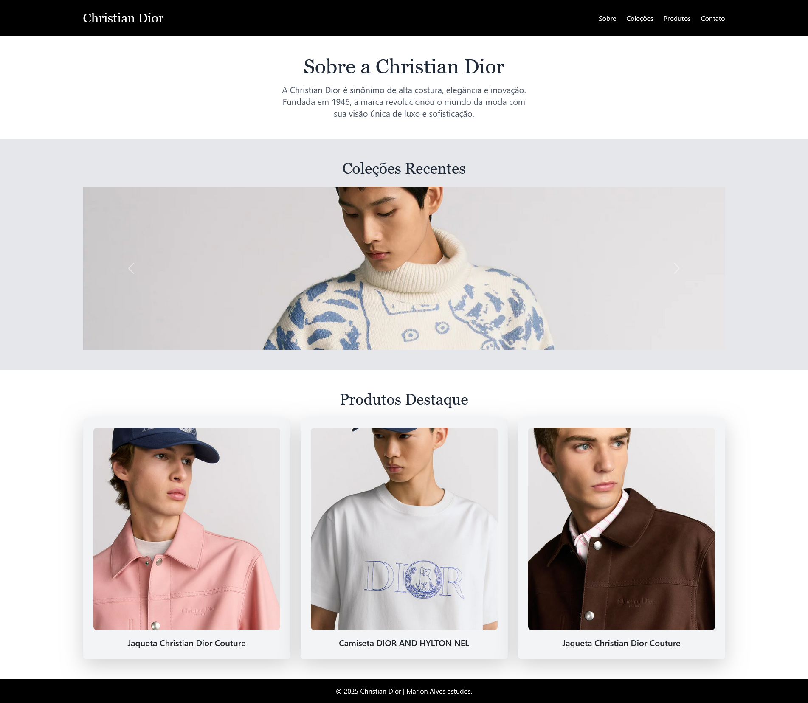

# Christian Dior Culture - Website



Este é um website simples criado para apresentar a marca **Christian Dior**, suas coleções e produtos em destaque. A estrutura do site é responsiva, utilizando **Bootstrap** e **Tailwind CSS** para garantir um layout moderno e funcional. O projeto inclui um carrossel de imagens para exibir as coleções e modais para destacar os produtos.

## Tecnologias Utilizadas

- **HTML5** - Estrutura e conteúdo do site.
- **CSS (Tailwind e Bootstrap)** - Estilo e layout do site.
- **JavaScript** - Para o funcionamento do carrossel e modais.
- **Google Fonts** - Fontes personalizadas para melhorar a tipografia.
- **Bootstrap** - Framework para componentes responsivos, como o carrossel e modais.
- **Tailwind CSS** - Utilizado para estilizar o site de maneira eficiente e customizável.

## Funcionalidades

- **Menu de navegação:** Links para as seções "Sobre", "Coleções", "Produtos" e "Contato".
- **Seção Sobre:** Apresenta informações sobre a história da marca Christian Dior.
- **Carrossel de Coleções:** Exibe imagens de coleções recentes da marca.
- **Produtos em Destaque:** Apresenta três produtos com imagens e descrições. Ao clicar nas imagens, são exibidos modais com mais detalhes sobre cada produto.
- **Rodapé:** Contém informações de copyright e um link de contato por e-mail.

## Como Rodar o Projeto

1. Clone o repositório:
    ```bash
    git clone <URL-do-repositório>
    ```
2. Navegue até o diretório do projeto:
    ```bash
    cd <diretório-do-projeto>
    ```
3. Abra o arquivo `index.html` em seu navegador para visualizar o site.

## Estrutura de Arquivos

- `index.html`: Página principal do site.
- `README.md`: Este arquivo, que fornece informações sobre o projeto.

## Contribuições

Sinta-se à vontade para contribuir com melhorias e correções. Para isso, crie um *pull request* explicando a mudança.

## Licença

Este projeto foi criado para estudos de HTML, TailwindCSS, Bootstrap.
